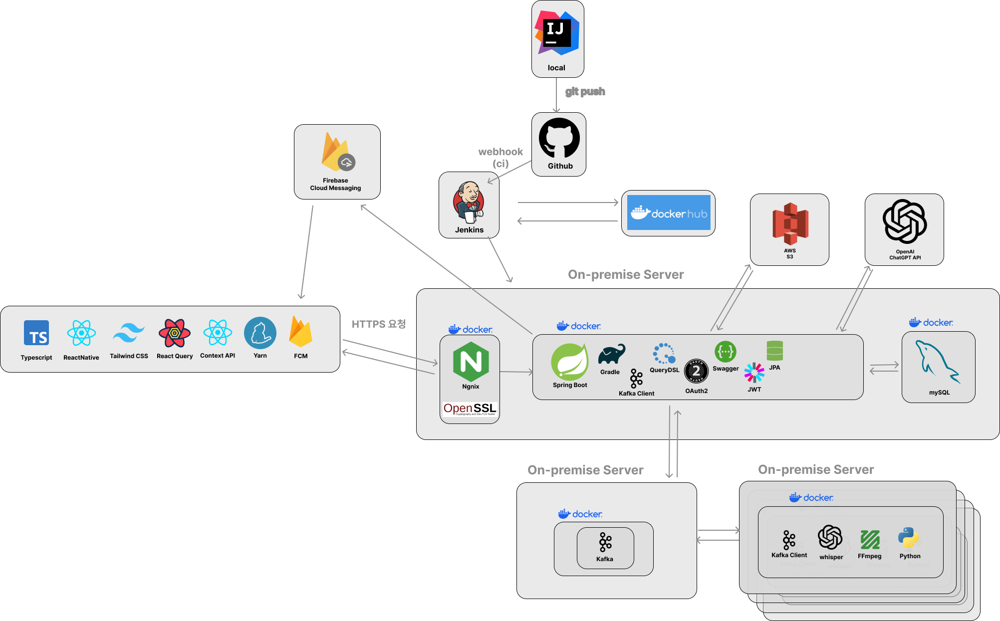

# 2024_DANPOON_TEAM_22_BE
내일 모래 - 사람의 목소리로 자립 준비 청년의 일상을 밝히는 서비스 

## 🏝️ 서비스 설명 🏝️
***내일모래’는 사람의 목소리로 자립 준비 청년의 일상을 밝히는 서비스 입니다.***

우리의 일상은 사랑하는 사람들의 목소리로 가득합니다.
이른 아침 나를 깨우는 부모님의 목소리, 아플 때 나를 챙겨주는 걱정어린 목소리, 기쁜 일이 있을 때 진심으로 나를 축하하는 목소리가 쌓이고 쌓여 삶의 동기와 용기가 되어주죠.

그러나, 이런 어른의 정서적 지지를 받지 못하는 청년들이 있습니다.
바로 “자립 준비 청년” 입니다.

이런 말 들어보신 적 있나요?
”아이 하나를 키우는데 온 동네가 필요하다.” 라는 말이요.
보육원에서 독립하여 세상에 홀로서기를 시작한 자립 준비 청년의 고립과 외로움에 필요한 건, 일상을 밝히는 따뜻한 온 마음을 담은 목소리 아닐까요?
’내일모래’는 이로부터 출발한 서비스 입니다.

 

## ⚒️️ Architecture ⚒️

 

## 🗒️ Convention 🗒️
> ### ➡️ [Git Convention](./docs/git-convention.md)

> ### ➡️ [Branch Convention](./docs/branch-convention.md)

> ### ➡️ [Code Convention](./docs/code-convention.md)
